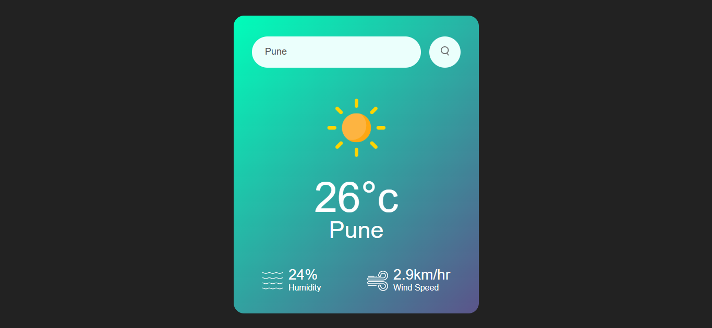

# Weather App

A simple web-based Weather App that allows users to check the current weather of any city using real-time data from a weather API.

## Features

- Search weather by city name.
- Displays temperature, weather condition, humidity, and wind speed.
- Responsive design for mobile and desktop.

## Technologies Used

- HTML5
- CSS3
- JavaScript
- Weather API (e.g., OpenWeatherMap)

## Screenshots

Home Page of Weather App:

Search Result Page:

